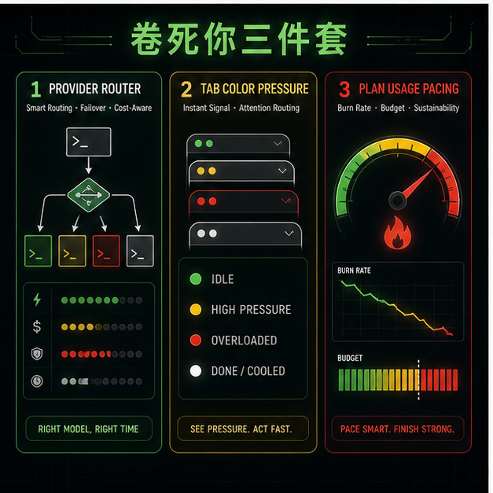
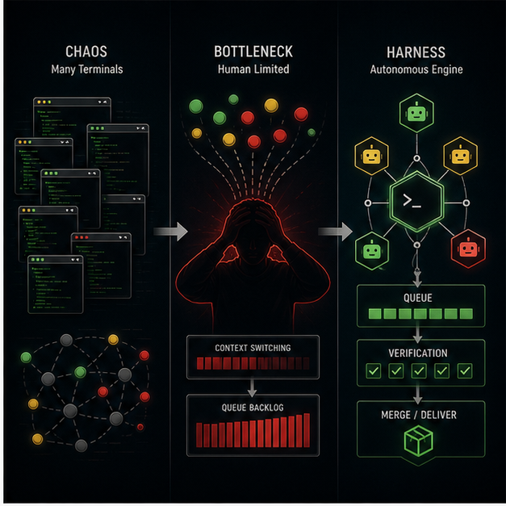
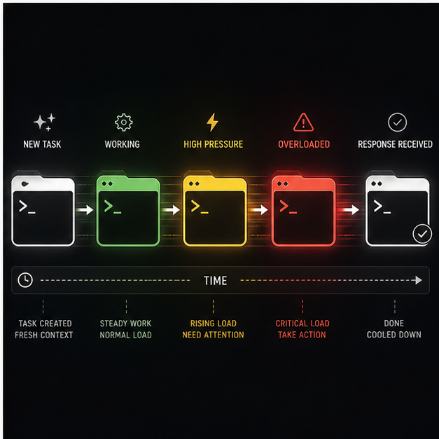

# BurnKit

> 先榨干你，再逼你 harness。

[English README](README.md)

BurnKit 是给并行跑 Claude Code 和 Codex 的开发者准备的三件套。它帮你把任务路由到正确 Provider，在 AI 等你时染色提醒空闲 tab，并盯住昂贵 plan 窗口有没有悄悄空转。

中文精神名：`卷死你三件套`。

不是我卷疯了，也不是想把你卷疯。

BurnKit 的本质，是把 AI 编程里最尴尬的事实摊开：模型越来越快，但工作流仍然卡在人身上。你以为自己缺的是更强模型，结果真正拖慢吞吐的是 Provider 选择、空闲 session、上下文切换、plan 窗口浪费，以及那个永远在回答“要不要继续”的人类调度器。

BurnKit 先把这些东西变成信号。等信号多到你接不住，你就会自然开始问：怎么让 AI 少问我？怎么让它自己排队、分工、验证、交付？

没错，这就是 harness 的入口。


## 你会得到什么

| 工具 | 命令 | 职责 | 为什么需要它 |
|------|------|------|--------------|
| Claude Provider Router | `bin/burnkit router 0` | 用编号 Provider 启动 Claude Code，并支持 Agent Team leader/teammate 分流 | 把正确任务放到正确模型、endpoint 和额度上 |
| iTerm2 Tab Color | `bin/burnkit install tabs` | Claude Code / Codex 等你时，把非当前 iTerm2 tab 染色 | 把被遗忘的 prompt 变成可见压力 |
| Burn AI | `bin/burnkit status --refresh` | 追踪本机 Claude Code / Codex plan usage 和燃烧节奏 | 别浪费昂贵窗口，也别每个周期无脑打满 |

> **提示：** 如果你的菜单栏比较拥挤，可以安装 [Dozer](https://github.com/Mortennn/Dozer)（免费开源）来隐藏不常用的图标，让 Burn AI 的信息更突出。



## 让你的 Agent 自动安装

把下面这段话复制给你的 AI coding agent，让它帮你自动安装：

```text
帮我在这个仓库里安装 BurnKit。

规则：
- 先运行 `scripts/e2e-install-verify.sh --dry-run`。
- 运行 `bin/burnkit doctor`。
- 所有 BurnKit 安装目标先 dry-run，再考虑真实安装：
  - `bin/burnkit install router --dry-run`
  - `bin/burnkit install tabs --dry-run --skip-python-check`
  - `bin/burnkit install burn --dry-run`
- 不要覆盖 `tools/claude-provider-router/config.env`。如果它已经存在，必须 byte-for-byte 保留。
- 真实安装前，先告诉我会修改哪些文件和系统状态，然后等待我明确确认。
- 我确认后，再执行真实安装，并用 `scripts/e2e-install-verify.sh --real` 验证结果。
```

重点是：`config.env` 里是 Provider token。合格的 agent 必须在它已存在时原样保留。

## 手动安装

```bash
git clone https://github.com/doingdd/iterm2-claude-tab-color.git burnkit
cd burnkit

bin/burnkit doctor
bin/burnkit install router
pip3 install iterm2
bin/burnkit install tabs
bin/burnkit install burn
```

然后编辑 Provider 配置：

```bash
$EDITOR tools/claude-provider-router/config.env
```

通过 BurnKit 启动 Claude Code：

```bash
bin/burnkit router 0
bin/burnkit router team 7 0
```

查看 plan 燃烧状态：

```bash
bin/burnkit status --refresh
```

## 它制造的循环

```text
1. 开更多 AI session。
2. 看空闲 tab 变绿、变黄、变红。
3. 用 Burn AI 看 5h / 7d plan 窗口有没有被浪费。
4. 撞上人类调度极限。
5. 开始设计真正的 agent harness。
```



这才是重点。BurnKit 不是让你永远手动接球的工具。它是一个压力装置：榨干你的空闲时间、上下文切换，以及“一个人能手动调度十个 agent session”的幻觉。

到了极限之后，问题不再是鸡血口号，而是架构问题：

```text
为什么它总要问我？
为什么它不能自己判断下一步？
为什么我还在当人肉 event loop？
为什么这些 session 不能排队、分工、验证、交付？
```

没错。你开始 harness 了。

## 命令地图

| 命令 | 用途 |
|------|------|
| `bin/burnkit doctor` | 检查本机依赖和三个工具的就绪状态 |
| `bin/burnkit install router` | 执行 router 内部安装器；仅在缺少 `config.env` 时从模板创建 Provider 配置 |
| `bin/burnkit install tabs` | 通过 BurnKit 统一入口安装 iTerm2 Tab Color |
| `bin/burnkit install burn` | 安装/build Burn AI，然后执行 `burn-ai install` |
| `bin/burnkit install all` | 依次执行 router setup、tab color install、Burn AI install |
| `bin/burnkit router 0` | 用 Provider 配置 `0` 启动 Claude Code |
| `bin/burnkit router team 7 0` | 启动 Agent Team 路由：leader 用 `7`，teammate 用 `0` |
| `bin/burnkit burn doctor` | 转发到 Burn AI CLI |
| `bin/burnkit status --refresh` | 刷新并打印 plan usage 状态 |

`bin/burnkit` 是发布入口，不是偷偷摸摸的全局安装器。每个工具仍然保留自己的运行文件、安全检查和卸载路径。

## Tab 压力协议

| 颜色 | 含义 | 操作信号 |
|------|------|----------|
| 绿色 | AI 刚跑完，正在等你 | 现在收结果 |
| 黄色 | 已经等了一会儿 | 你的并行能力开始漏水 |
| 红色 | 等太久了 | 机器准备好了，人迟到了 |
| 白色 | 当前 tab、处理中，或干净状态 | 这里暂时不需要注意 |

只有非当前 tab 会变色。你正在看的 tab 保持白色，因为提示应该指向你没看到的地方。



## 项目结构

```text
.
├── bin/
│   └── burnkit
├── tools/
│   ├── claude-provider-router/
│   ├── iterm2-tab-color/
│   └── burn-ai/
├── assets/
├── AGENTS.md
├── CLAUDE.md
├── README.md
└── README.zh-CN.md
```

根目录不提供 `install.sh` / `uninstall.sh`。对用户可见的安装、卸载统一走 `bin/burnkit install ...` / `bin/burnkit uninstall ...`；子工具里的 `install.sh` / `uninstall.sh` 只作为兼容 wrapper 或维护者排障入口。

## 工具文档

- [Claude Provider Router](tools/claude-provider-router/README.md)
- [iTerm2 Tab Color](tools/iterm2-tab-color/README.md)
- [iTerm2 Tab Color 中文说明](tools/iterm2-tab-color/README.zh-CN.md)
- [Burn AI](tools/burn-ai/README.md)

## 安全边界

- `tools/claude-provider-router/config.env` 包含 token，不能提交。
- Burn AI 不处理登录态、不托管凭据、不主动请求内部 usage API；只读取 Claude Code / Codex 已经在本机产生的 usage 数据。
- Burn AI 不覆盖用户已有 Claude Code status line。若已存在 status line，它会先交互式确认再安装 wrapper；跳过时会打印手动接入步骤，并说明哪些 Claude 功能会保持不可用。
- tab 颜色行为、state 清理、进程检测、hook 事件、daemon 调度都属于功能行为变更，不能混进文档或发布润色里。

## 开发验证

修改发布入口后至少运行：

```bash
bash -n bin/burnkit
bin/burnkit --help
bin/burnkit doctor
scripts/e2e-install-verify.sh --dry-run
```

在本机执行真实安装验证：

```bash
scripts/e2e-install-verify.sh --real
```

这个 e2e 验证脚本覆盖 router 两条路径：裸环境缺少 `config.env` 时会从模板创建并设为 `600`；已有 `tools/claude-provider-router/config.env` 时会 byte-for-byte 保留内容和权限。

修改 iTerm2 Tab Color 后至少运行：

```bash
bash -n tools/iterm2-tab-color/install-core.sh tools/iterm2-tab-color/uninstall-core.sh tools/iterm2-tab-color/install.sh tools/iterm2-tab-color/uninstall.sh tools/iterm2-tab-color/tab_color_hook.sh
python3 -m py_compile tools/iterm2-tab-color/tab_color_daemon.py tools/iterm2-tab-color/reset_tab.py tools/iterm2-tab-color/test_daemon.py
python3 -m unittest tools/iterm2-tab-color/test_daemon.py
```

修改 Burn AI 后至少运行：

```bash
cd tools/burn-ai
npm ci
npm test
npm run build
npx --no-install burn-ai install
burn-ai install
npx --no-install burn-ai doctor --dry-run
npx --no-install burn-ai status --fixtures
npx --no-install burn-ai menubar render
git diff --check
```

## License

[MIT](LICENSE)
