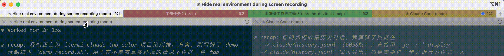

# iTerm2 AI CLI Tab Color

> BurnKit 的 tab 压力层：在 iTerm2 中用 tab 颜色监控 Claude Code 和 Codex CLI 的空闲状态。

[English README](README.md)

当你同时打开多个 Claude Code 或 Codex CLI session 时，很难判断哪个 tab 已经回复完、正在等你输入，以及已经等了多久。这个工具会自动给 iTerm2 tab 上色，让需要关注的位置一眼可见。



## 行为规则

| Tab 颜色 | 含义 | 触发条件 |
|----------|------|----------|
| 绿色 | AI CLI 刚回复完，正在等你 | `Stop` hook 写入 idle state |
| 黄色 | 已等待一段时间 | 空闲超过 `THRESHOLD_YELLOW`，默认 10 分钟 |
| 红色 | 等太久，需要处理 | 空闲超过 `THRESHOLD_RED`，默认 20 分钟 |
| 白色 | 活跃、处理中，或没有 idle state | 当前活跃 tab、提示/工具活动、或 idle state 全部清空 |

关键规则：

- 只有非当前 tab 会上色。当前正在看的 tab 始终保持白色，因为你已经在处理它。
- 颜色是 tab 级别，不是 pane 级别。一个 tab 里有多个 pane 时，整个 tab 使用同一个颜色。
- 同 tab 多 session 采用保守聚合。只要同一个 tab 里还有多个 idle state，就使用最严重颜色：红色优先于黄色，黄色优先于绿色。
- 在某个 pane 里开始新请求，只会清理这个 pane/session 对应的 state。如果同 tab 另一个 pane 仍有红色 idle state，tab 仍会保持红色。
- 当一个 tab 里的所有 AI CLI session 都处于处理中、活跃、关闭、或已经回到 shell 时，tab 才会恢复白色。

## 功能

- 在仓库根目录执行 `bash tools/iterm2-tab-color/install.sh` 一键安装
- 提供 `uninstall.sh`，可移除 hook、launchd 配置和 JSON hook 条目
- Claude Code 和 Codex CLI 共用同一个 hook 脚本
- 支持 split pane：同一个 iTerm2 tab 内颜色一致
- 感知当前活跃 tab：颜色作为非当前 tab 的提醒标记
- 快速退出清理：pane 回到 `zsh`/`bash` 后快速清理，不增加重型进程扫描频率
- 支持配置时间阈值、颜色、轮询间隔和并发提示
- macOS launchd 托管，支持登录自启动、KeepAlive 和 iTerm2 断线重连

## 快速开始

### 前置条件

- macOS + [iTerm2](https://iterm2.com/)
- Python 3.10+
- `iterm2` Python 包
- Claude Code CLI 和/或 Codex CLI

### 安装

从 BurnKit 仓库根目录：

```bash
pip3 install iterm2
bin/burnkit install tabs
```

直接安装本工具：

```bash
pip3 install iterm2
git clone https://github.com/doingdd/iterm2-claude-tab-color.git
cd iterm2-claude-tab-color
bash tools/iterm2-tab-color/install.sh
```

安装脚本会：

- 创建 Claude/Codex hook 软链
- 写入真实 launchd plist：`~/Library/LaunchAgents/com.duying.tab-color-daemon.plist`
- 注册 Claude Code hooks：`Stop` 和 `PreToolUse`
- 创建/更新 `~/.codex/hooks.json`，并注册静默 Codex hooks：`Stop`、`PreToolUse`、`UserPromptSubmit`
- 启动后台 daemon，并设置为登录后自动启动
- 在修改 JSON 配置前创建 `.bak.YYYYmmdd-HHMMSS` 备份
- 明确打印每一步创建、更新、备份和启动动作

预演安装，不落盘：

```bash
bash tools/iterm2-tab-color/install.sh --dry-run
```

卸载：

```bash
bash tools/iterm2-tab-color/uninstall.sh
```

卸载脚本默认保留 `~/.claude/idle_state` 和 daemon log。如需一起删除：

```bash
bash tools/iterm2-tab-color/uninstall.sh --purge-state
```

### 验证

```bash
launchctl list | grep tab-color
tail -f ~/.claude/idle_state/daemon.log
```

打开一个 Claude Code 或 Codex CLI session，发送请求并等待完成。session 进入 idle 后，tab 应该变成绿色。

## 配置

编辑 `tools/iterm2-tab-color/config.sh`：

```bash
# 时间阈值，单位：分钟
THRESHOLD_YELLOW=10
THRESHOLD_RED=20

# Tab 颜色，RGB 0-255
COLOR_GREEN_R=30;   COLOR_GREEN_G=180;  COLOR_GREEN_B=30
COLOR_YELLOW_R=220; COLOR_YELLOW_G=160; COLOR_YELLOW_B=0
COLOR_RED_R=200;    COLOR_RED_G=40;     COLOR_RED_B=40

# 重型进程扫描间隔，单位：秒
POLL_INTERVAL=30

# 可选：日志中的并发提示目标
CONCURRENT_TARGET=3
```

修改后重启 daemon：

```bash
launchctl kickstart -k gui/$(id -u)/com.duying.tab-color-daemon
```

## 架构

```text
Claude / Codex hook events
        |
        v
tab_color_hook.sh
        |
        | 写入 ~/.claude/idle_state/*.json
        v
tab_color_daemon.py
        |
        | iTerm2 Python API
        v
iTerm2 tab color
```

### Hook 脚本

`tab_color_hook.sh` 同时处理 Claude Code 和 Codex CLI。

- `Stop`：通过 terminal escape sequence 快速设为绿色，并写入 idle state 文件。
- `PreToolUse` / `UserPromptSubmit`：重置 tab，删除当前 session state，并在后台启动 `reset_tab.py` 做快速整 tab 重置。
- Codex hook 注册为静默命令，因为 Codex Stop hook 会把 stdout 当 JSON 校验。

### Daemon

`tab_color_daemon.py` 由 launchd 托管，是唯一通过 iTerm2 API 写颜色的组件。
它启用 iTerm2 Python API retry；iTerm2 重启、升级或 websocket 断开后会尝试自动重连，避免 idle state 停留在绿色且不再升级。

- Watch loop，每 500ms：读取 state 文件，轻量清理已回到 shell 的 pane，应用 tab 颜色，并重置最后一个 state 消失的 tab。
- 快速退出清理，每 1 秒最多一次：只使用 iTerm2 `jobName` 判断，不增加 `ps`/`pgrep` 重型扫描开销。
- Poller，每 `POLL_INTERVAL` 秒：执行较重的孤儿清理，检查真实 Claude/Codex 进程是否存在，升级绿色到黄色/红色，只更新元数据，不直接写 iTerm2 颜色。

### State 模型

每个 idle AI session 在 `~/.claude/idle_state/` 下对应一个 JSON 文件。

State 文件包含：

- `agent`：`claude` 或 `codex`
- `iterm2_session`：iTerm2 pane id，通常是 `w0t1p2:UUID`
- `agent_session`：agent session id
- `idle_since`：Unix timestamp
- `color_stage`：`green`、`yellow` 或 `red`

daemon 会按 iTerm2 tab 聚合 state。只有当 tab 当前活跃，或该 tab 没有任何 idle state 时，tab 才会是白色。

## 运行时文件

- `~/.claude/hooks/tab_color_hook.sh` -> 指向本工具目录的软链
- `~/.codex/hooks/tab_color_hook.sh` -> 指向本工具目录的软链
- `~/.claude/idle_state/*.json` -> 每个 session 的 idle state
- `~/.claude/idle_state/daemon.log` -> daemon 日志
- `~/Library/LaunchAgents/com.duying.tab-color-daemon.plist` -> 生成的 launchd plist 真实文件

## 常用命令

```bash
# 查看 daemon 状态
launchctl list | grep tab-color

# 查看 daemon 日志
tail -f ~/.claude/idle_state/daemon.log

# 重启 daemon
launchctl kickstart -k gui/$(id -u)/com.duying.tab-color-daemon

# 删除运行时文件
launchctl unload ~/Library/LaunchAgents/com.duying.tab-color-daemon.plist
rm ~/.claude/hooks/tab_color_hook.sh
rm ~/.codex/hooks/tab_color_hook.sh
rm ~/Library/LaunchAgents/com.duying.tab-color-daemon.plist
```

卸载后，如有需要，再从 `~/.claude/settings.json` 和 `~/.codex/hooks.json` 中删除 `tab_color_hook.sh` 相关条目。

## 开发

```bash
bash -n install.sh uninstall.sh tab_color_hook.sh
python3 -m py_compile tab_color_daemon.py reset_tab.py test_daemon.py
python3 -m unittest test_daemon.py
```

以上开发命令在 `tools/iterm2-tab-color/` 目录下执行。

## License

[MIT](../../LICENSE)
